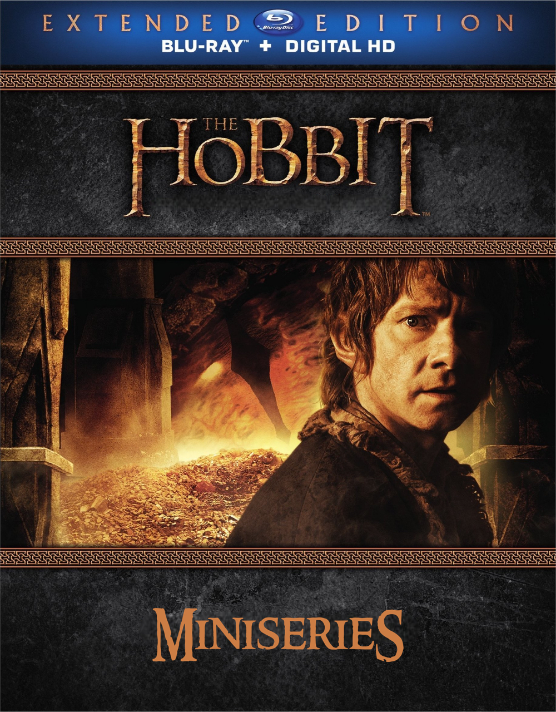

If you loved the wonder and grandeur of An Unexpected Journey, but couldn't stand the Fíli-Tauriel romance or some of Alfrid’s antics later in the series, this fanedit miniseries is your perfect escape.

The Hobbit (Miniseries) splits PJ’s trilogy into 11 episodes, each running ∼45 minutes and named after the book chapters. This edit preserves the original structure of the films, carefully trimming away the Fíli-Tauriel romance and Alfrid's antics to maintain a more focused narrative. Plot-wise, the one key alteration involves the death of Kíli, which now occurs simultaneously with Fíli's, witnessed by Thorin and Bilbo. With these changes, this miniseries is ideal for fans who want to immerse themselves as much as possible in the world of Middle-Earth without minor distractions.

Crafted from the original Blu-ray Extended Editions, this fanedit ensures the highest possible quality in both video and audio, and is available both in English and Spanish.

## Trailer



## Episodes

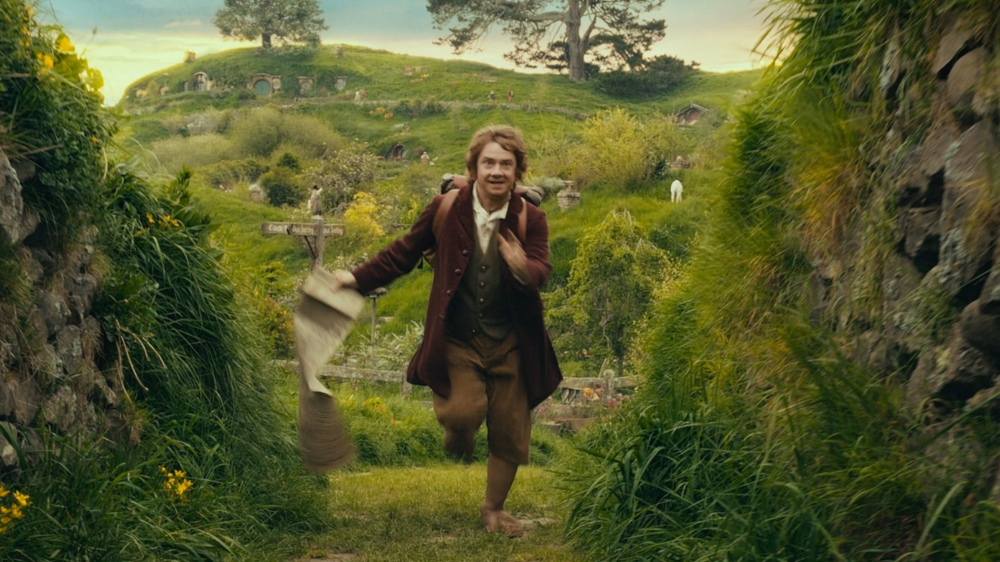

### 1. AN UNEXPECTED PARTY (43:14)
Bilbo Baggins, a reluctant hobbit, is unexpectedly swept into an adventure with Gandalf and a group of dwarves to reclaim the Lonely Mountain from the dragon Smaug, leaving his peaceful life in the Shire behind.

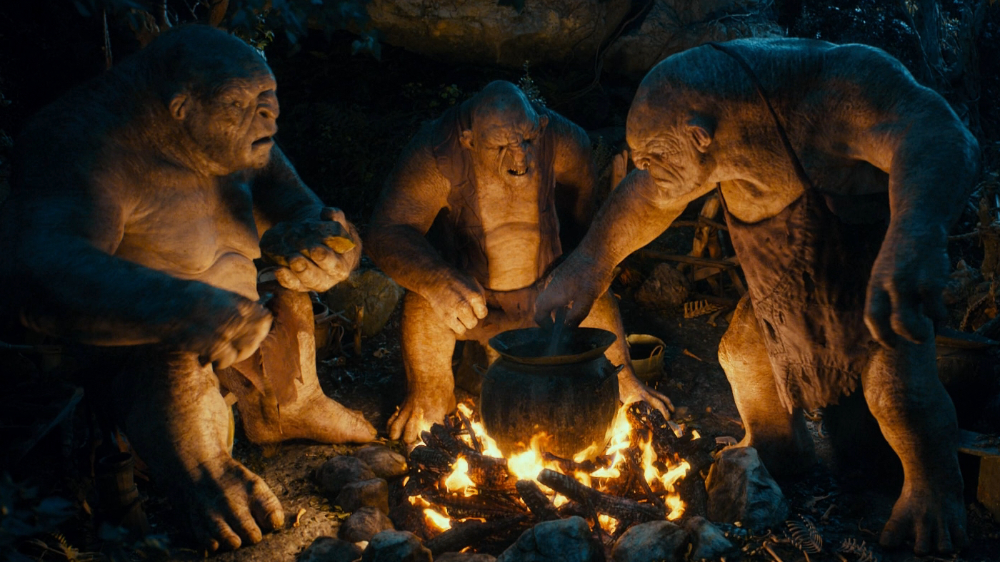

### 2. ROAST MUTTON (42:02)
After leaving the Shire, Bilbo and the dwarves face numerous dangers, including trolls, goblins, and Wargs, before finding refuge in Rivendell. Meanwhile, the White Council convenes in Rivendell.

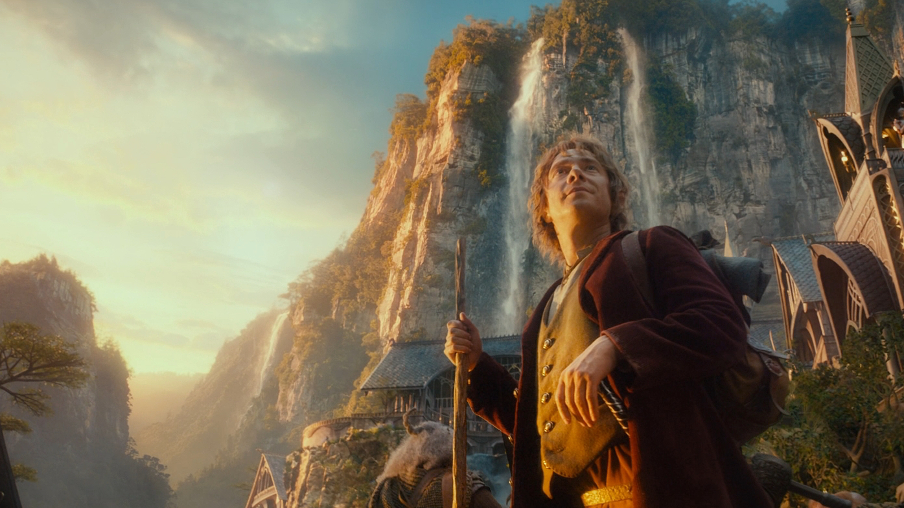

### 3. A SHORT REST (44:30)
In Rivendell, the company receives guidance from Elrond before continuing their journey, encountering more dangers along the way, including the treacherous path through the Misty Mountains, where Bilbo is separated from the group and falls into the dark caves.

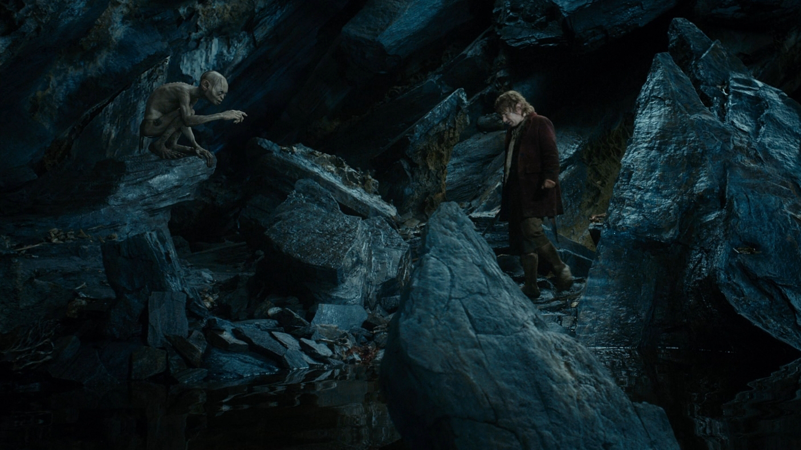

### 4. RIDDLES IN THE DARK (42:48)
After falling into the mountain caves, Bilbo encounters Gollum, finds the One Ring, and then reunites with the dwarves. Together, they face a dangerous escape from goblins and Wargs, culminating in their rescue by the eagles.

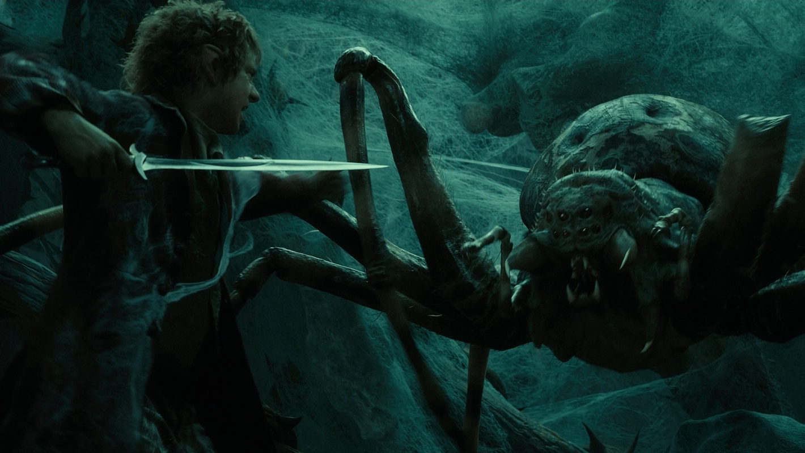

### 5. FLIES AND SPIDERS (47:28)
The company rests at Beorn’s house and continues their journey through Mirkwood, where they are attacked by giant spiders and eventually captured by the Wood Elves.

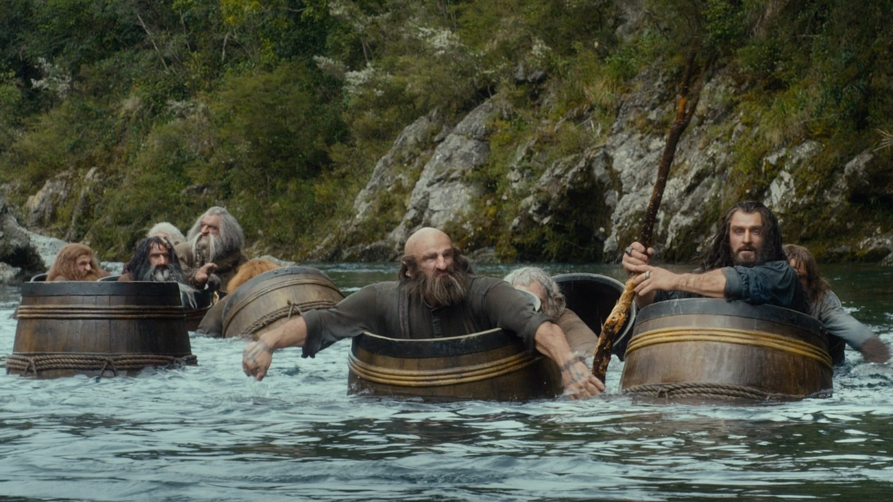

### 6. BARRELS OUT OF BOND (46:56)
After being imprisoned by the Elves, Bilbo and the dwarves escape in barrels, floating down the river to Lake-town, where they are welcomed by the people and eventually make their way to Bard's house. Meanwhile, Gandalf investigates the Nine Kings of Men tombs.

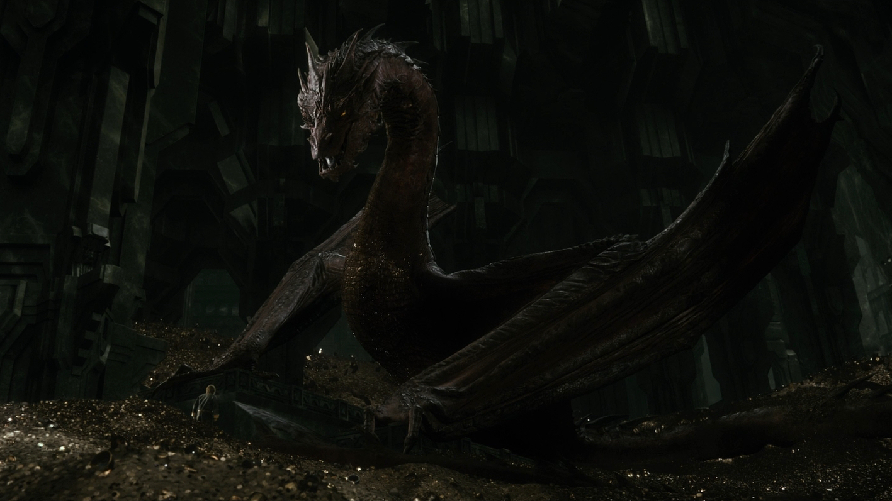

### 7. A WARM WELCOME (43:20)
After arriving in Lake-town, the company makes their way to the Lonely Mountain, where they enter the secret passage and discover the treasure hoard. As they explore, Bilbo encounters the dragon Smaug. Meanwhile, Gandalf is imprisoned in Dol Guldur.

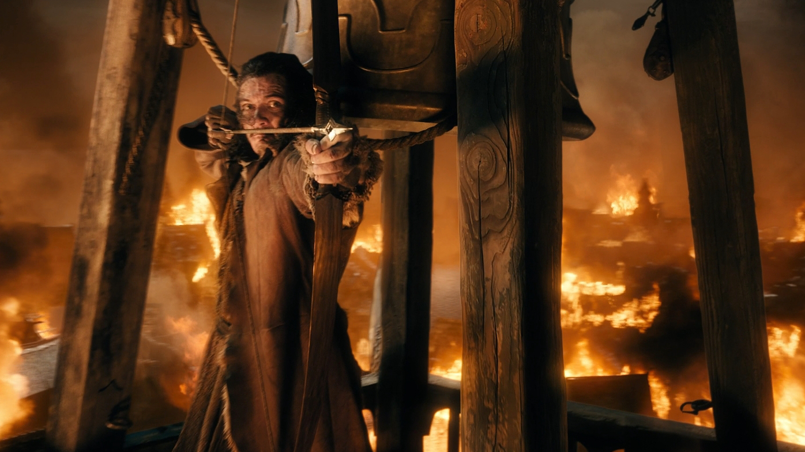

### 8. FIRE AND WATER (45:43)
After Bilbo’s encounter with Smaug, the dwarves, including Thorin, confront the dragon in the mountain, but Smaug taunts them before flying out to attack Lake-town. Bard kills the dragon with an arrow, saving the town.

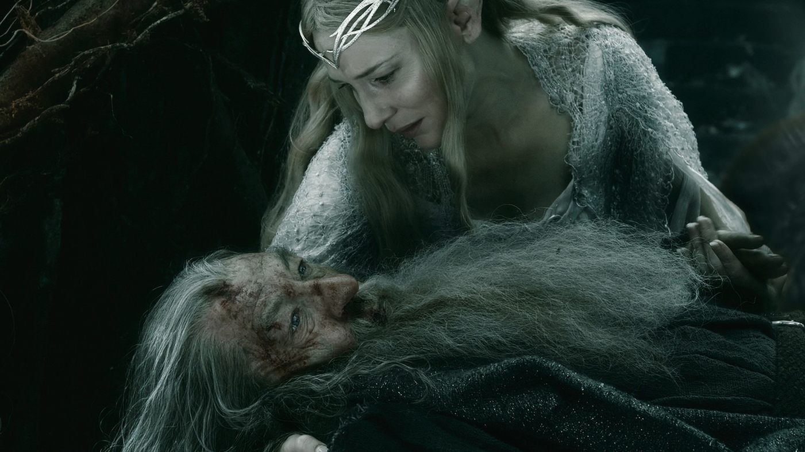

### 9. THE GATHERING OF THE CLOUDS (45:09)
After Smaug’s death, tensions rise between elves, men, and dwarves, all preparing to claim the treasure. Meanwhile, Galadriel, Elrond, and Saruman go to aid Gandalf, confronting the Nine Kings of Men, and the White Council ultimately defeats Sauron.

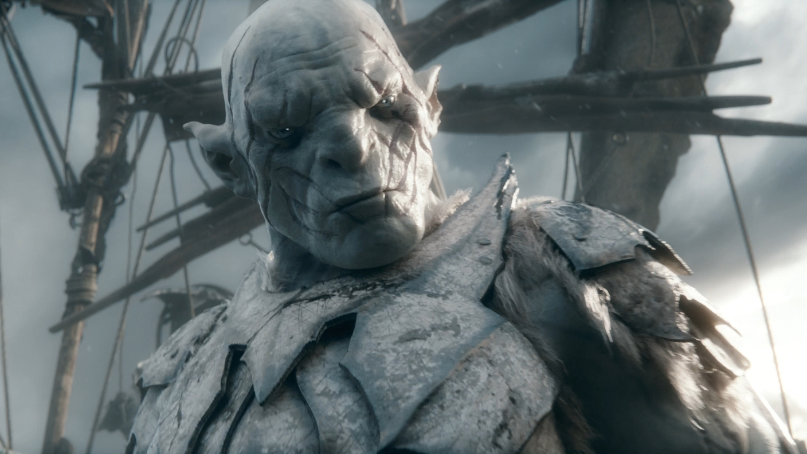

### 10. THE CLOUDS BURST (43:56)
The Battle of the Five Armies begins, first between dwarves, elves, and men. As the battle continues, they must unite against the orc and goblin forces. During the chaos, Thorin and his best warriors fight valiantly at Ravenhill.

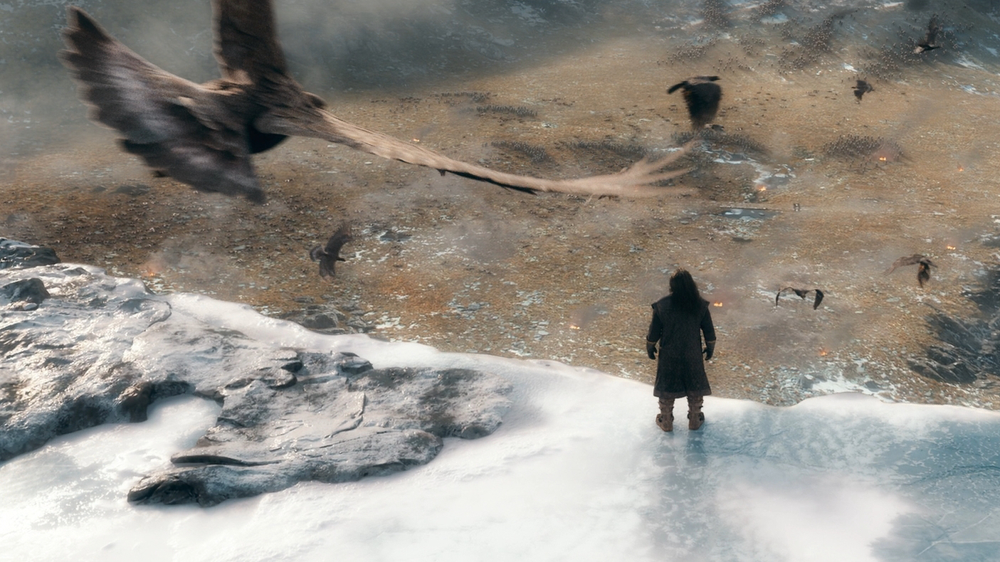

### 11. THE LAST STAGE (43:07)
After Thorin arrives at Ravenhill, he battles Azog the Defiler in a final, tragic confrontation, where he is mortally wounded. As Thorin dies, Bilbo is able to say goodbye, and the battle ends with the defeat of the orc army. The dwarves, elves, and men agree to a fragile peace.

## Main edits

The strategy behind this edit followed three main guidelines:
1. **Removing the Kíli-Tauriel romance:** I trimmed their scenes to change the nature of their relationship. Instead of a mutual romance, Kíli’s feelings for Tauriel are now portrayed as one-sided. Tauriel is shown as someone who cares deeply for all living beings, with Kíli being just another one of them. The dynamic I aimed for is somewhat akin to the relationship between Gimli and Galadriel in The Lord of the Rings.
2. **Trimming Alfrid:** While Alfrid still moves the plot forward, most of his scenes have been cut, including his entire arc. The last we see of him is hiding during the battle, and I removed any further comedic moments (such as the lady-dressing scenes) to keep the focus on the main story.
3. **Ensure highest quality, aiming for 45-minute episodes cut at cliffhanger moments:** After ripping original Blu-rays to keep highest quality in both video (1080p resolution and 20+ Mb/s bitrate) and audio (7.1/5.1 Surround), I restructured the edit to fit 45-minute episodes, naming them after the chapters from the book that best align with the events. Additionally, I added short credits at the end of each episode, accompanied by the Misty Mountains theme, to maintain the atmosphere.

Plot-wise, the one key alteration involves the death of Kíli, which now occurs simultaneously with Fíli's, witnessed by Thorin and Bilbo. Apart from that, I’ve tried to preserve the original structure and artistic decisions.

Other relevant notes from this edit:
* Merged the end of DoS and the beginning of BoFA into the same episode.
* Trimmed some Extended Edition battle scenes from BoFA that lacked a soundtrack and didn’t add to the story.
* The Dol Guldur plot remains untouched, although trimmed some of Radagast’s antics.

